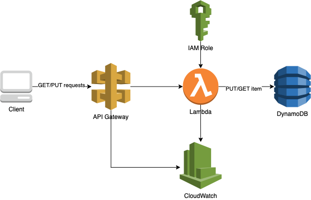

# Serverless birthday app - Amazon API Gateway HTTP API to AWS Lambda
This repository contains an AWS Lambda function that saves/updates the given user’s name and date of birth in the database and returns hello birthday messages for the given user. The Terraform template deploys a Lambda function, a DynamoDB table, Amazon API Gateway HTTP API, CloudWatch log groups and the minimum IAM resources required to run the application.

The process flow is as follows:

  

## Develop applications

### Development Environment Prerequisites
* [Create an AWS account](https://portal.aws.amazon.com/gp/aws/developer/registration/index.html) if you do not already have one and log in. The IAM user that you use must have sufficient permissions to make necessary AWS service calls and manage AWS resources (with permissions to IAM, Lambda, API Gateway, CloudWatch and DynamoDB.
* [AWS CLI](https://docs.aws.amazon.com/cli/latest/userguide/install-cliv2.html) installed and configured
* [Git Installed](https://git-scm.com/book/en/v2/Getting-Started-Installing-Git)
* [Terraform](https://learn.hashicorp.com/tutorials/terraform/install-cli?in=terraform/aws-get-started) installed 
* Python [3.8](https://www.python.org/downloads/) with [boto3](https://boto3.amazonaws.com/v1/documentation/api/latest/guide/quickstart.html) package

### Deployment Instructions
1. Clone the GitHub repository:
    ``` 
    git clone https://github.com/MarcinWojtasEit/serverless-birthday-app
    ```
1. Change directory to the pattern directory:
    ```
    cd serverless-birthday-app/terraform
    ```
1. From the command line, initialize terraform to download and install the providers defined in the configuration:
    ```
    terraform init
    ```
1. From the command line, apply the configuration:
    ```
    terraform apply -var="aws_region=<region>" -var="aws_profile_name=<profile_name>"
    ```
1. During the prompts:
    * Enter yes
1. Note the outputs from the deployment process, these contain the base URL for API Gateway stage which are used for testing.

### How it works
This pattern deploys an Amazon API Gateway HTTP API. The routes are integrated with an AWS Lambda function written in Python. The lambda function is integrated with DynamoDB. The function logs the incoming API event (v2) and context object to an Amazon CloudWatch Logs log group and returns information to the caller.

### Testing

Once the stack is deployed, retrieve the base URL for API Gateway stage from the outputs of the terraform apply, then call the endpoint using curl or Postman.

1. Insert a user and date of birth items in the table by executing the following CURL command at the prompt:
    ```
    curl -X PUT -d '{"dateOfBirth": "<dateOfBirth>"}' '<base_url>'/hello/<username>
    ```

    This should output the 204 status code

2. Let's retrieve the birthday message by executing the following CURL command at the prompt:

    ```
    curl -X GET '<base_url>'/hello/<username>
    ```

    This will display the output as follows:

    ```
    { 
        “message”: “Hello, <username>! Your birthday is in N day(s)”
    }
    ```
    or
    ```
    {
        “message”: “Hello, <username>! Happy birthday!”
    }
    ```

### Cleanup
 
1. Change directory to the pattern directory:
    ```
    cd serverless-birthday-app/terraform
    ```
1. Delete all created resources
    ```bash
    terraform destroy
    ```
1. During the prompts:
    * Enter yes
1. Confirm all created resources has been deleted
    ```bash
    terraform show
    ```

### Unittest
1. Change directory to the pattern directory:
    ```
    cd serverless-birthday-app/src
    ```
1. Install virtual environment
    ```bash
    python3 -m venv .venv
    source .venv/bin/activate
    pip install --upgrade pip
    pip install -r requirements.txt 
    ```
1. Run unit test:
    ```bash
    coverage run -m pytest test.py
    ```
1. Creating code coverage report
    ```bash
    coverage html --omit='.venv/*'
    open htmlcov/index.html
    ```

## Develop and test your serverless applications locally with DynamoDB local.
The SAM template deploys a Lambda function, a DynamoDB table and the IAM resources required to run the application.

### Development Environment Prerequisites
- [Install AWS CLI](https://docs.aws.amazon.com/cli/latest/userguide/cli-chap-install.html) and [configure](https://docs.aws.amazon.com/cli/latest/userguide/cli-chap-configure.html) the credentials.
- [Docker](https://runnable.com/docker/getting-started/) installed 
- [SAM CLI](https://docs.aws.amazon.com/serverless-application-model/latest/developerguide/serverless-sam-cli-install.html)
- Python [3.8](https://www.python.org/downloads/) with [boto3](https://boto3.amazonaws.com/v1/documentation/api/latest/guide/quickstart.html) package

### Steps to deploy this application locally
1.  Clone the GitHub repository:
    ``` 
    git clone https://github.com/MarcinWojtasEit/serverless-birthday-app
    ```
2. Change directory:
    ```
    cd serverless-birthday-app
    ```
3. Create docker network  
	```
    docker network create local-api-network
    ```  

4. Start DynamoDB Local by executing the following at the command prompt:  
	```
    docker run -d -p 8000:8000 --network=local-api-network --name dynamo-local amazon/dynamodb-local
    ```  
    This will run the DynamoDB local in a docker container at port 8000.  

5. At the command prompt, list the tables on DynamoDB Local by executing:  
    ```
    aws dynamodb list-tables --endpoint-url http://localhost:8000
    ```  

6. An output such as the one shown below confirms that the DynamoDB local instance has been installed and running:
    ```
    {  
      "TableNames": []   
    }
    ```    

7. At the command prompt, create the users table by executing:  
    ```
    aws dynamodb create-table --cli-input-json file://json/local-db-create.json --endpoint-url http://localhost:8000
    ```  
      
    **Note:** If you misconfigured your table and need to delete it, you may do so by executing the following command:
    ```  
    aws dynamodb delete-table --table-name users --endpoint-url http://localhost:8000
    ```  

8. At the command prompt, start the local API Gateway instance by executing:  
    ```
    sam local start-api --docker-network local-api-network
    ```  

### Testing the application
1. Insert a user and date Of birth items in the table by executing the following CURL command at the prompt:  
    ```
    curl -X PUT -d '{"dateOfBirth": "1995-10-20"}' http://127.0.0.1:3000/hello/<username>
    ```

    This should output the 204 status code

2. Let's retrieve the item from the local DynamoDB instance by executing the following CURL command at the prompt:
    ```  
    curl -X GET http://127.0.0.1:3000/hello/<username>
    ```  

    This will display the output as follows: 
    ``` 
    { 
        “message”: “Hello, <username>! Your birthday is in N day(s)”
    }
    ```
    or
    ```
    {
        “message”: “Hello, <username>! Happy birthday!”
    }
    ```
     
**Note:** You may alternatively use a GUI to view the items on the local DynamoDB instance, such as the [DynamoDB Local Shell](http://localhost:8000/shell/) or [DynamoDB Manager](https://github.com/YoyaTeam/dynamodb-manager).
